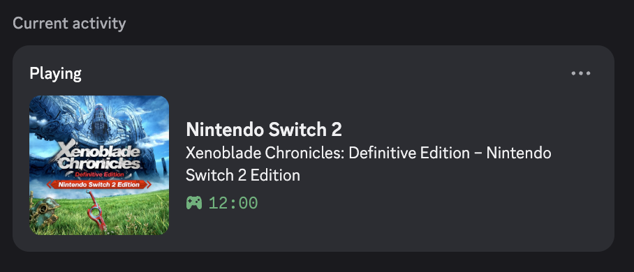

# Description
A custom script I made that scrapes [DekuDeals](https://www.dekudeals.com) using a specified query term, which is used to create a custom discord rich presence. This is a purely personal project, so I probably won't maintain it that closely, but I've outlined the basic steps to get this working for yourself.

# Setup
1. Create a discord application (look up how to do this if you don't already know how). Name it whatever you want the bold text to be at the top. Make note of the `Application ID`.
2. Run `make create_env` to create the venv for this project.
3. Copy the `.env` file to `.env.local` and populate the `APP_ID` field with the `Application ID` you got earlier.
4. Activate the venv via `. ./.venv/switch-discord-rpc/bin/activate`.
5. Run `python main.py "name of the game you want to display"` on a machine with discord logged in and running.